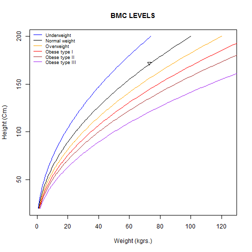

BMC - Calculator
========================================================
author: Francisco Gonzalez Alonso
date: 2016/10/01
autosize: true

BMI description and use
========================================================
# What is the BMI- Body Mass Index?

The body mass index (BMI) or Quetelet index is a value derived from the mass 
(weight) and height of an individual. 

The BMI is defined as the body mass divided by the square of the body height, 
and is universally expressed in units of kg/m2, resulting from mass in kilograms 
and height in metres.

The BMI is an attempt to quantify the amount of tissue mass (muscle, fat, and 
bone) in an individual, and then categorize that person as underweight, normal 
weight, overweight, or obese based on that value. 

[Body mass index - WIKIPEDIA]("https://en.wikipedia.org/wiki/Body_mass_index")

BMI description and use
========================================================
# How I can calculate the BMI?

Calculate this index is very easy, just you have to know your height and weight, through the equation: 
**$$BMI= \frac{mass_{kg}}{height_m^{2}} = {703}\times{\frac{mass_{lb}}{height_{in}^{2}}}$$**

And compare your BMI with the different ranges of BMI:

| Category BMI(kg/m2)                   	|  From 	|    To 	|
|---------------------------------------	|------:	|------:	|
| Very severely underweight             	|       	| >15.0 	|
| Severely underweight                  	|  15.0 	|  16.0 	|
| Underweight                           	|  16.0 	|  18.5 	|
| Normal (healthy weight)               	|  18.5 	|  25.0 	|
| Overweight                            	|  25.0 	|  30.0 	|
| Obese Class I (Moderately obese)      	|  30.0 	|  35.0 	|
| Obese Class II (Severely obese)       	|  35.0 	|  40.0 	|
| Obese Class III (Very severely obese) 	| >40.0 	|       	| 	

BMI description and use
========================================================
# Example

For a person with 73 kg weight and 1.72 meters tall, his BMI is:

**$$BMI= \frac{mass_{kg}}{height_m^{2}}= \frac{73_{kg}}{1.72m^{2}}=24.6755003$$**

And It correspond with a normal weight class.

BMC Calculator 
=======================================================
# BMC Calculator User Instructions

You can run my App from several forms:

* Run it in Shinyapps: [bmc-calculator]("https://lanthano.shinyapps.io/bmc-calculator/")

* Run it Local: for it you must:
    + Download the server.R and ui.R from my repository in Github and copy them 
    in the same directory.
    
    + Load Both in RStudio.
    
    + Install shiny library and run it with the follow code:
    
    ~~~~
    install.packages("shiny");
    library(shiny);
    runApp();
    ~~~~

[For more information] ("http://shiny.rstudio.com/tutorial/lesson7/")

* To calculate Your BMI you must enter your name (optional), weight and height, and then click on the Calculate button.

